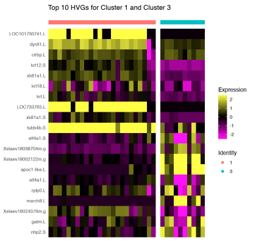

# Reprogramming-Cell-Fate

This repository investigates whether the regional boundaries of blastula cells change after endoderm nuclei transfer (NT). The project is based on findings from two key papers published by our lab:
1. **Characterisation of the transcriptional dynamics underpinning the function, fate, and migration of the mouse Anterior Visceral Endoderm.**  
   Shifaan Thowfeequ, Jonathan Fiorentino, Di Hu, Maria Solovey, Sharon Ruane, Maria Whitehead, Bart Vanhaesebroeck, Antonio Scialdone, Shankar Srinivas  
   DOI: [https://doi.org/10.1101/2021.06.25.449902](https://doi.org/10.1101/2021.06.25.449902)
2. **CIARA: a cluster-independent algorithm for the identification of markers of rare cell types from single-cell RNA seq data.**  
   Gabriele Lubatti, Marco Stock, Ane Iturbide, Mayra L. Ruiz Tejada Segura, Richard Tyser, Fabian J. Theis, Shankar Srinivas, Maria-Elena Torres-Padilla, Antonio Scialdone  
   DOI: [https://doi.org/10.1101/2022.08.01.501965](https://doi.org/10.1101/2022.08.01.501965)

Key insights include:
- Embryo cells exhibit gene expression dynamics along the diffusion pseudotime, reflecting developmental progression along the spatial axis.
- NT-induced changes in blastula cells prompt questions about boundary shifts between ectoderm, mesoderm, and endoderm regions.
---

## Repository Structure

| Directory      | Description                                      |
|----------------|--------------------------------------------------|
| `/script`      | Scripts for integrating data, clustering, pseudotime mapping, plotting gene expression, and GO analysis. |
| `/data`        | Contains raw and processed data used across notebooks. |
| `/plots`       | Example plots and visualizations generated from the analysis. |

---

## Key Plots and Results

### UMAP Visualization of Clusters
This UMAP visualization highlights IVF and NT data, showing clusters of interest (e.g., Cluster 1 and 3).

---

### Top HVGs for Clusters 1 and 3
Heatmap visualization of the top 10 HVGs in Clusters 1 and 3.

---

### Highly Localized Genes (HLG) in Cluster 3
Plot of highly localized genes identified in Cluster 3.

---

### Diffusion Pseudotime Analysis
Diffusion pseudotime trajectory for cells in the dataset.

---

### Gene Expression vs Diffusion Pseudotime
This plot demonstrates the gene expression trends along the diffusion pseudotime for various HVGs and HLGs in clusters 3 and 9.

---

### Hierarchical Clustering of Genes
Hierarchical clustering of identified genes.

---

### Gene Ontology (GO) Analysis
GO analysis results for hierarchical clustering groups.

---

## Conclusion
Our results reveal that NT disrupts regional boundaries in blastula cells:
- Genes `vegt.S` and `wnt11b.L` are misexpressed in animal cup cells, indicating disrupted boundaries.
- Over time, these genes are suppressed, restoring normal boundaries.

This dataset serves as a basis for exploring mechanisms of reprogramming and transcriptional dynamics in embryonic development.

---

## Contact

**Dr. Antonio Scialdone**  
Computational Biology Laboratory, Helmholtz Zentrum München  
Email: [Antonio.Scialdone@helmholtz-munich.de](mailto:Antonio.Scialdone@helmholtz-munich.de)  

For technical queries related to the analysis, please contact:  
**Ding-Yang Wang**  
Email: [deweywang2000@gmail.com](mailto:deweywang2000@gmail.com)
